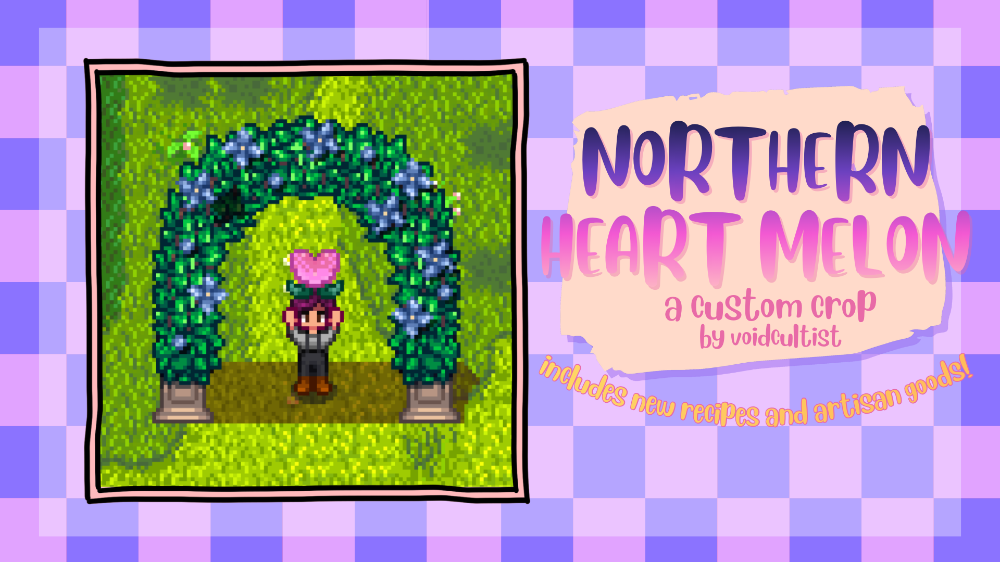

# Northern Heart Melon Custom Crop

This mod adds the new custom crop **Northern Heart Melon**. It is a mod that was made as companion mod to [NPC Pei Ming](https://www.nexusmods.com/stardewvalley/mods/39402) but can also be used as a standalone. In addition to the [crop itself](#northern-heart-melon), this mod adds the following recipes and goods:

* [Glazed Heart Melon](#glazed-heart-melon)
* [Love Tea](#love-tea)
* [Giftable Tassel (Exclusive to NPC Pei Ming mod)](#giftable-tassel)
* [Equippable Tassel](#equippable-tassel)
* [Heart Melon Huangjiu](#heart-melon-huangjiu)
* 

The following sections will talk about the items in detail as well as their unlock conditions for players __without__ the NPC Pei Ming installed. For players with NPC Pei Ming installed, please refer to [this readme](github.com/void-cultist/PeiMingSDV).

## Northern Heart Melon

| How to obtain? | Price | Growth duration | Season |
| ------------- | ------------- |-------------|-----------|
| Desert Trader (seeds!)  | 3 Prismatic Shards | 20 days | Winter |

## Glazed Heart Melon

| How to obtain? |Price | 
| ------------- | ------------- |
| Night Market Day 2 (Recipe) | 125000 |

## Love Tea

| How to obtain? |Price | 
| ------------- | ------------- |
| Night Market Day 3 (Recipe) | 250000 |

## Giftable Tassel

The giftable tassel does not appear ingame without NPC Pei Ming installed.

| How to obtain? |Price | 
| ------------- | ------------- |
| Volcano Trader with at least 8 Hearts with Pei Ming and at least 1 farmhouse upgrade | 125000 / 250000 / 500000 |

This item does nothing on its own and is only used to propose to Pei Ming to become roommates.

 

## Equippable Tassel

This tassel provides several buffs and can be equipped in the ring slot.

**Without Pei Ming** 

| How to obtain? |Price | 
| ------------- | ------------- |
| Volcano Trader when Combat Skill Level = 10 | 250000 / 500000 / 750000 |

With Pei Ming

| How to obtain? |Price | 
| ------------- | ------------- |
| Volcano Trader after having received the [Giftable Tassel](#giftable-tassel) recipe and having gifted said tassel to Pei Ming |  250000 / 500000 / 750000 |

## Heart Melon Huangjiu

| How to obtain? |Price | 
| ------------- | ------------- |
| After ~~having played for 128 days~~ (before 1.1.0) having earned 1,000,000 gold (as of 1.1.0), you will receive a letter that will unlock the ability to make Heart Melon Huangjiu in kegs. |  n.a. |
Requires 1 Northern Heart Melon + 2 Unmilled Rice

## Heart Melon Syrup
| How to obtain? |Price | 
| ------------- | ------------- |
| n.a | 2 x base price |
Requires 2 Northern Heart Melon + 2 Sugar

## Heart Melon Pastry
| How to obtain? |Price | 
| ------------- | ------------- |
| You'll receive a quest from Gus after shipping 1 Northern Heart Melon and having at least 5 Hearts with him. Completing this quests unlocks the Heart Melon Pastry recipe. | 1.2 x Northern Heart Melon base price |

## Heart Melon Donut
| How to obtain? |Price | 
| ------------- | ------------- |
| After having completed Gus' quest and having received his letter with the Pastry recipe, the Heart Melon Donut recipe can be purchased in the Saloon. | 1.5 x Northern Heart Melon base price |

## Heart Melon Candy
| How to obtain? |Price | 
| ------------- | ------------- |
| When entering the Secret Woods, there's a small chance an event to obtain the recipe plays. Alternatively, this event plays during a Green Rain Day. |  |
